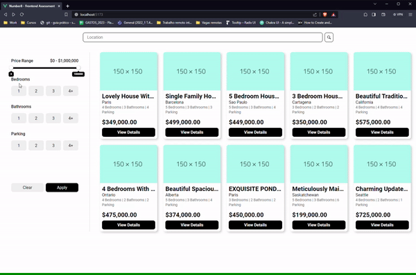

# frontend-assessment

## Demo



## Technologies Used

- [Vue 3](https://vuejs.org/)
- [SASS](https://sass-lang.com/)
- [Vue Router](https://router.vuejs.org/)
- [Vueform/Slider](https://github.com/vueform/slider)
- [Maska](https://beholdr.github.io/maska/#/)
- [ESLint](https://eslint.org/)
- [Prettier](https://prettier.io/)
- [Vite](https://vitejs.dev/)

## Solution

## Architecture

I chose the MVC pattern for this project because it is a well-established and well-respected design pattern that can be used to create scalable and maintainable applications. The MVC pattern separates the user interface, data, and application logic into three distinct components, which makes the code more modular and easier to maintain.

Here are some of the benefits of using the MVC pattern:

- Modularity: The MVC pattern makes the code more modular and easier to maintain. Each component is responsible for a specific task, which makes it easier to add new features or fix bugs.
- Reusability: The MVC pattern promotes code reuse. For example, the model and component components could be reused in other applications.
- Testability: The MVC pattern makes the code more testable. Each component can be tested in isolation, which makes it easier to identify and fix bugs.

Overall, I think the MVC pattern is a good choice for this project because it will help to create a scalable, maintainable, and testable application.

In addition to the above benefits, the MVC pattern is also a good choice because it is a well-known pattern that is easy for other developers to understand. This can make it easier to collaborate with other developers on the project and to maintain the project in the future.

### Directory structure

```
frontend-assessment/
└── src/
    ├── assets/
    │   ├── main.css
    │   └── ...
    ├── components/
    │   ├── CardComponent.vue
    │   └── ...
    ├── models/
    │   ├── propertyList.json
    │   └── ...
    ├── router/
    │   └── index.js
    ├── sections/
    │   ├── FilterSection.vue
    │   └── ...
    ├── utils/
    │   ├── currencyFormatter.js
    │   └── ...
    └── views/
        ├── HomeView.vue
        └── ...
```

The directory structure you provided maps to the MVC pattern as follows:

- Models: The models directory contains the data for the application, such as the property list in your example.
- Views: The views directory contains the pages for the application, such as the HomeView.vue page in your example.
- Components: The components directory contains reusable components that can be used in the views, such as the CardComponent.vue component in your example.
- Utils: The utils directory contains reusable utility functions, such as the currencyFormatter.js function in your example.
- Router: The router directory contains the router configuration for the application.

Additional Notes

- The assets directory contains static assets, such as CSS and images.
- The sections directory contains reusable components that can be used in the views, but are specific to a particular section of the application, such as the FilterSection.vue component in your example.

### List and Filter Solution

For listing and filtering the properties, I decided to create an computed property responsible for filtering the array of items based on multiple criterias.

The `filteredItems` computed property filters the propertyList array based on the values of the location and filters ref variables. It does this by checking each item in the propertyList array to see if it meets all of the filter criteria. If it does, the item is added to the filteredItems array.

```javascript
const filteredItems = computed(() =>
  propertyList.filter((item) => {
    const itemLocation = item.Location.toLowerCase()
    const locationFilter = itemLocation.startsWith(location.value.toLowerCase())

    const { bedrooms, bathrooms, parking, priceRange } = filters.value

    const priceFilter = item['Sale Price'] >= priceRange[0] && item['Sale Price'] <= priceRange[1]
    let bedFilter = bedrooms.length ? bedrooms.includes(item.Bedrooms) : true
    let bathFilter = bathrooms.length ? bathrooms.includes(item.Bathrooms) : true
    let parkingFilter = parking.length ? parking.includes(item.Parking) : true

    if (bedrooms.includes(4)) {
      bedFilter = bedFilter || item.Bedrooms >= 4
    }

    if (bathrooms.includes(4)) {
      bathFilter = bathFilter || item.Bathrooms >= 4
    }

    if (parking.includes(4)) {
      parkingFilter = parkingFilter || item.Parking >= 4
    }

    return locationFilter && bedFilter && bathFilter && parkingFilter && priceFilter
  })
)
```

- The `locationFilter` variable stores the result of checking if the item's location starts with the user's input.
- The `{ bedrooms, bathrooms, parking, priceRange }` variables store the values of the corresponding filters.
- The `priceFilter` variable stores the result of checking if the item's sale price is within the specified price range.
- The `bedFilter`, `bathFilter`, and `parkingFilter` variables store the result of checking if the item meets the corresponding filter criteria.

If the item meets all of the filter criteria, the return statement returns `true`, which means that the item will be added to the `filteredItems` array. Otherwise, the return statement returns `false`, which means that the item will not be added to the `filteredItems` array.


### Form Validation

For the form validation, I used a combination of regular expressions and conditional statements to check if the user's input is valid.

```javascript
const handleSubmit = () => {
  validation.value = {
    name: false,
    email: false,
    phone: false,
    comments: false
  }

  successMessage.value = false

  if (!name.value.match(/^([^ ]+[\s]+[^ ]+)$/)) {
    validation.value.name = 'Your full name must contain at least one first name and one last name'
  }

  if (!name.value.match(/^[a-zA-Z ]+$/)) {
    validation.value.name = 'Your full name must contain only letters and spaces'
  }

  if (!email.value.length) {
    validation.value.email = 'This field is required'
  }

  if (!phone.unmasked || !phone.unmasked.match(/^\d{10,}$/)) {
    validation.value.phone = 'Your phone number must be at least 10 digits long'
  }

  if (!comments.value.match(/^.{1,}$/)) {
    validation.value.comments = 'This field is required'
  }

  if (
    !validation.value.name &&
    !validation.value.email &&
    !validation.value.phone &&
    !validation.value.comments
  ) {
    successMessage.value = 'Message sent successfully!'
  }
}

```

- The `validation` object stores the validation status of each field.
- The `successMessage` variable stores the success message.
- The first four `if` statements check if the user's input for each field is valid. If it is not valid, the corresponding validation error message is set.
- The last `if` statement checks if all of the fields are valid. If they are, the success message is set.

Using a library could make the form validation code more efficient and easier to maintain, but for this solution I prefered to make it quickly, comprehensive and easy to understand.

## Project Setup

```sh
git clone https://git.number8.com/rafael.domingues/frontend-assessment.git
cd fontend-assessment
npm install
```

### Compile and Hot-Reload for Development

```sh
npm run dev
```

### Compile and Minify for Production

```sh
npm run build
npm run preview
```

### Lint with [ESLint](https://eslint.org/)

```sh
npm run lint
```

### Format with [Prettier](https://prettier.io/)

```sh
npm run format
```
